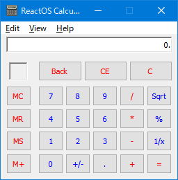

#  Independent ReactOS Calc

This is `"Independent ReactOS Calc"` from [ReactOS](https://reactos.org/).

It's a free and open source software for Windows XP and later.

  

  
  

## Main code contributors

- Copyright 2007-2017 Carlo Bramini
- and more!

## Translators

- Copyright 2008 Caemyr - Olaf Siejka
- Copyright 2008 Javier Remacha
- Copyright 2009 Petru Dimitriu (petrimetri@gmail.com)
- Copyright 2011 Saibamen - Adam Stachowicz (saibamenppl@gmail.com)
- Copyright 2011 Song Fuchang (0xfc) (sfc_0@yahoo.com.cn)
- Copyright 2011 mkbu95 (mkbu95@gmail.com)
- Copyright 2011-2018 Ștefan Fulea (stefan.fulea@mail.com)
- Copyright 2013-2014, 2016, 2019 Erdem Ersoy (eersoy93) (erdemersoy [at] erdemersoy [dot] net)
- Copyright 2014 Ismael Ferreras Morezuelas
- Copyright 2021 Chan Chilung (eason066@gmail.com)
- Copyright 2021 Gabriel Aguiar (fgygh5804@gmail.com,fgsoftwarestudio@gmail.com)
- Copyright 2021 Süleyman Poyraz (zaryob [dot] dev [at] gmail [dot] com)
- Copyright 2021 Wu Haotian (rigoligo03@gmail.com)
- Copyright 2022 Andrei Miloiu (miloiuandrei@gmail.com)
- Copyright 2022 Wilson Simanjuntak (wilsontulus5@gmail.com)
- Copyright Ardit Dani (Ard1t) (ardit.dani@gmail.com)
- Copyright Artem Reznikov & Sakara Yevhen
- Copyright Baruch Rutman
- Copyright Jaix Bly
- Copyright Mário Kačmár /Mario Kacmar/ aka Kario (kario@szm.sk)
- Copyright Nagy Tibor (xnagytibor at gmail dot com)
- Copyright Radek Liska aka Black_Fox (radekliska at gmail dot com)
- Copyright manatails007 (www.manatails007.org) Seungju Kim
- and more!

## Tested Environments

Tested on Visual Studio 2015, and Visual Studio 2019.

## Bugs

- Abnormal termination on MSYS2 and MinGW.

## License

- GPL 2.0 and later
